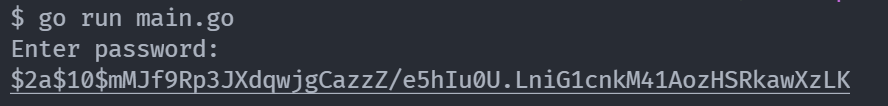

## Golang Bcrypt

Generate bcrypt password from command line, input typing is hidden.


## Run

```bash
go run main.go
```

will be like this:




## Building
You can compile and make a shortcut to it by running:

```bash
go build -o bcrypt main.go
```

and move that `bcrypt` generated file to somewhere. 

> Note: Make sure to give this build the right permissions to run on your operational system.